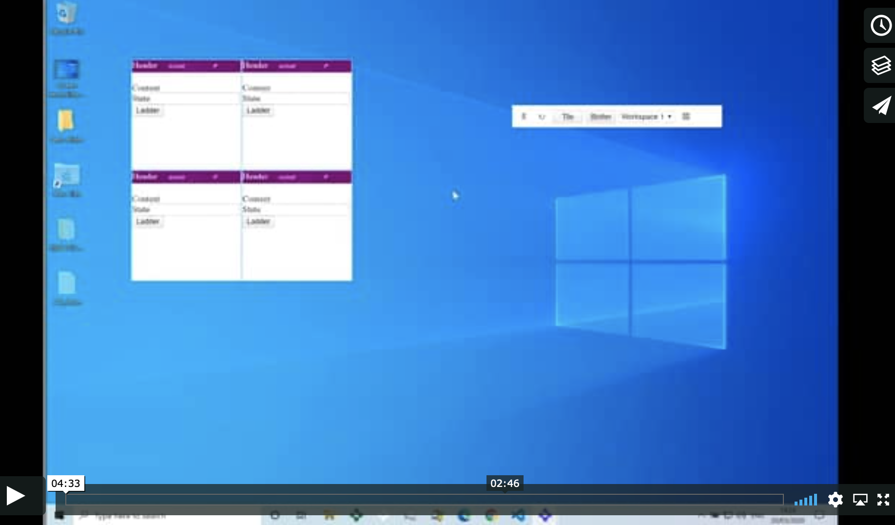

# Simple Launchbar Demo Using Customized Platform API

(Currently no build, no NPM - to merge this code into a different repo that does).

_Requirements_

A localhost file server of choice on port 5001
The OpenFin CLI

_Sample Usage_

```
npx http-server -p 5001 -c-1
openfin -l -c http://localhost:5001/app.json
```

This is a sample of how a team can control how their windows behave.

The concepts from this sample can be taken as a pattern that can be customised to the snapping/docking behaviour a team wants (as docked behaviour when you have windows that dynamically resize comes down to preference).

The examples here break things into multiple pieces:

platform.js

* Platform (a new openfin api) can launch windows as well as views (views participate in the platform layout engine). 
* Platform gives the ability to save and restore layout (and additional snapshots of a layout).
* Platform lets you customise the behaviour of the Platform api to suit your needs (It can also be extended with company specific apis but this is not demonstrated here).
* Platform can check to see if a window is grouped to other windows and restore the group after launching the windows (through custom code).

workspace-manager.js

* A basic class that demonstrates a way of storing a platform snapshot as a workspace layout

snap-manager.js

* An example of a a class that can be used to determine snap zones and return a dock position that a window should be moved to. It also provides hooks so you can determine what should happen when a window is snapped. 

launcher-main.js

* This acts as the host class that wires up the snap manager, the application and provides the functions to the snap manager (telling it to group a window when snapped).
* It also provides the functionality for saving the workspace state and launches new windows (these responsibilities could be broken out into other classes).


group-manager.js

* It can be passed a function that it will call when a window becomes part of a group and when it leaves a group (it handles the extra notifications that the standard group event sends out so you are only notified when it counts).
* When a window that is watched becomes part of a group it disables manual resizing and being maximisable. It restores these settings when it is no longer part of a group (the actual settings can be customised)
* When a window that is watched resizes (programatically e.g. button click to expand the window) it passes the information to a group-layout-resolver (the window that changed, the windows in the group and the change that happened). The idea is that the group-layout-resolver can then re-position the other windows in the group if that is what you want.

collision-resolver.js

* This helper class is utilized after a grouped window has changed size or position. It has a resolve function that will attempt to resolve any collisions that have occurred as the result of a window resize event.
* This class is a work in progress with many edge cases but gives an idea of what can be done. This is one of the classes that would be implemented by a team to suit their needs (should a window overlay another window in the group? should it push all windows down? should it reflow all windows to avoid gaps?).

widget-frame.html

* This is an example of a window that has a control for ungrouping a window.
* It has a ladder button that expands and contracts the size of the window (this is to demonstrate the resolver).
* It also shows an important option to specify when resizing a window: moveIndependently: true (this gives you control over what should happen to the other windows in the group with the resolver).

The sample shows that you can have a lot of control with OpenFin in order to get the behaviour you wish. The goal is to have each part loosely coupled so that they can be used independantly or as part of a whole (i.e. you may just want the snap manager logic, or that along with the group layout engine and resolver).


Known issues:

* At the moment if you save a workspace with expanded ladders you need to drag the group before switching workspaces as the launcher-main.js is not picking up the change and updating the workspace snapshot.
* The example resolver still needs work (you can probably get edge cases).

More enhancements:

* Ability to specify that a window should not be able to dock with others when you launch it (through options. We have an entry point in customData but it is not honoured yet).
* Another window that has a different size (width and height) so that you can see how they behave in a group.
* Horizontal resizing - so that the layout resolver can give a basic example of that.
* if the taskbar icon for a window is clicked and it is in a group then bring all other windows in the group into the foreground (need to investigate)

You should be able to swap out our resolver for your own just to see the behaviour with the windows we have (to allow fast iteration of your resolver without firing up your own project).


## Layout v1 project

To help picture what the transition from layouts to platform could look like we have included a layouts v1 project that is very similar to the platform setup.

It can be lauched using the following command:

```
openfin -l -c http://localhost:5001/layoutv1/app.json

```

The code is similar except it uses the layout api. There is also a button on the launcher to save a snapshot of the workspace to localstorage.

If you do that then you will see a new icon appear on the platform launcher that lets you restore the layout v1 snapshot as a platform setup. This is done using:

- layout-to-platform.js


This converts a layoutv1 object to a platform object so that the customised platform api (platorm.js) launches and groups the windows to reflect how they were laid out in the layouts app.

This gives an example of how you could convert existing snapshots for when you migrate users from layouts v1 to platform.

[](https://vimeo.com/402123603)
