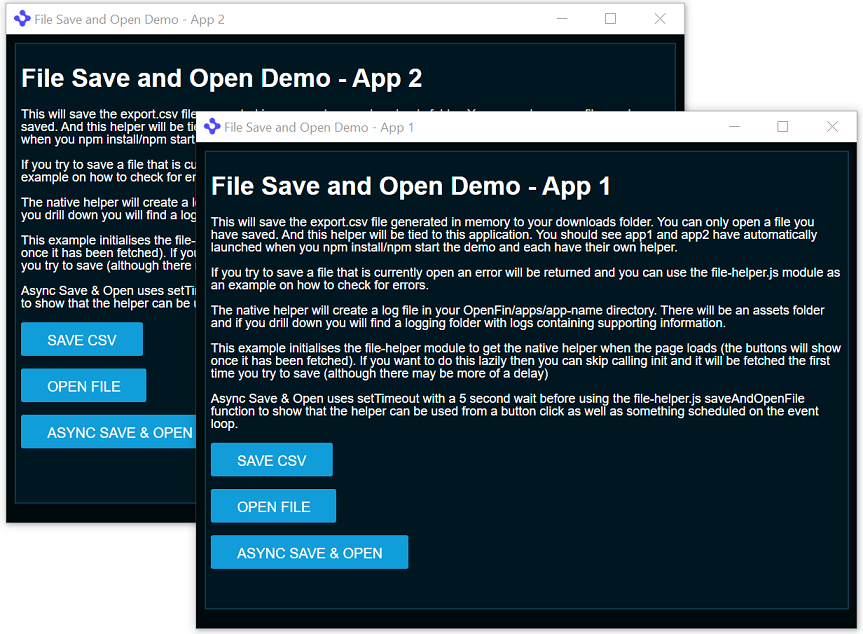

# Native Helper Demo

This example assumes you already have the OpenFin cli installed. If you do not please install it using:

*npm install -g openfin-cli*

This is an example of using .NET and our C# adapter to provide additional capabilities to your application.

This example (and it is purely an example) shows two applications launching with each of them defining a native helper in their manifests (public/app1.json and public/app2.json).

Our index.js file (triggered by npm start) sets up a localhost site on port 3000 which points to the public folder.

Steps to start:

* npm install
* npm start

This will cause two OpenFin applications to launch: app1 & app2.

App 1 will save csv data as export.csv and App2 will save data as export2.csv in your downloads folder.

The files of interest:

* index.js - this sets up the express js server using port 3000 and pointing to the public directory and launches two apps five seconds apart using the openfin-cli
* public/app1.json & public/app2.json (how do you define an asset that contains your helper and what permission you need to add).
* public/index.js - the script that binds the buttons and generates the data and uses the file-helper.js module.
* public/file-helper.js - an example module showing you how you can communicate with the native helper and validate responses. This approach should instantiate one helper for the lifetime of your application. The helper will be listening in for requests from your application.
* native-helper-src - a .NET solution containing a basic example of a helper that lets you achieve this functionality with some logging support added in. Native Helper logs will be within your OpenFin/apps/yourapplication/assets/native-helper/version/logging/ folder. E.g. app1 and app2 would be:  OpenFin/apps/OpenFin-FileHelper-Demo-App1/assets/native-helper/0.2.0/logging/ and OpenFin/apps/OpenFin-FileHelper-Demo-App2/assets/native-helper/0.2.0/logging/ 

The file-helper.js shows how to launch the native-helper without having to launch multiple instances and how to pass the identity of the app it should be paired with.

The native helper lets you specify which file types can be saved and opened. The default is:

* txt
* csv
* pdf

If you want to update this list you can:

### Update the config of the compiled version of native-helper

Extract native-helper.zip and open the *native-helper.exe.config* file.

Inside you will see an app settings section:

 ```csharp
    <appSettings>
        <add key="pdf" value="True" />
        <add key="txt" value="True" />
        <add key="csv" value="True" />
    </appSettings>
```

To disable support for an existing filetype change the value from True to False.

To add support for additional files type add a new entry to the app setting section e.g. :

 ```csharp
    <appSettings>
        <add key="pdf" value="True" />
        <add key="txt" value="True" />
        <add key="csv" value="True" />
        <add key="newtype" value="True" />
    </appSettings>
```
Save the file and create a new native-helper.zip file.

### Fresh build of native helper

Alternatively you can go to the native-helper-src directory and open the Visual Studio Solution.

You can open App.config and apply the same changes mentioned above. Rebuild the solution and it will build a new native-helper.zip file.




Again this is an example. Please treat it as such. 

License
MIT

The code in this repository is covered by the included license.

However, if you run this code, it may call on the OpenFin RVM or OpenFin Runtime, which are covered by OpenFin’s Developer, Community, and Enterprise licenses. You can learn more about OpenFin licensing at the links listed below or just email us at support@openfin.co with questions.

https://openfin.co/developer-agreement/
https://openfin.co/licensing/